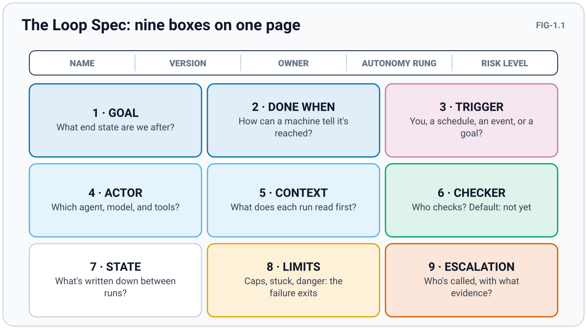

# Level 1 · STARTER: Design a loop on one page

⬅ [Level 0](00-level-0-zero.md) · 🏠 [README](README.md) · [Level 2](02-level-2-apprentice.md) ➡

**You'll be able to:**
- fill in a one-page Loop Spec: nine boxes that describe any loop;
- rewrite a chore ("fix the auth code") as an end state a machine can check;
- decide whether a task is worth looping at all, with five questions;
- pick a trigger and an autonomy rung for your first loop.

---

## The Lesson

### The Loop Spec: nine boxes on one page

A loop is a system, and systems need a design you can read in one minute. This guide uses one page with nine boxes. You'll fill it in for every loop you build, and the rest of the guide teaches each box in depth.



**FIG-1.1 · The Loop Spec.** *What to notice:* only two boxes (GOAL and CONTEXT) are about what you ask for. The other seven are about checking, remembering, and stopping. That's the shift from prompting to loop engineering.

| Box | What it answers | Taught in |
|---|---|---|
| **GOAL** | What end state are we after, in one sentence? | This level |
| **DONE WHEN** | How can a machine tell the goal is reached? (the success exit) | This level |
| **TRIGGER** | What starts a run: you, a schedule, an event, or a goal? | This level |
| **ACTOR** | Which agent and model, with which tools allowed? | Level 4 |
| **CONTEXT** | What does each run read first? | Levels 3–4 |
| **CHECKER** | Who checks, how, and what's the default answer? | Level 2 |
| **STATE** | What gets written down between runs, and where? | Level 3 |
| **LIMITS** | When does it stop without success? (caps, stuck, danger) | Level 3 |
| **ESCALATION** | Who gets called, with what evidence? | Level 3 |

The header adds five facts: **name**, **version**, **owner** (a person, not "the team"), **autonomy rung** (below), and **risk level** (what a bad run costs: low, medium, or high).

The blank template lives in [`kit/LOOP-SPEC.md`](kit/LOOP-SPEC.md). EX-1.2 below shows a filled one.

### Goals are end states, not chores

A chore describes work: "fix the auth code", "improve the newsletter". An **end state** describes the world once the work is done: "all tests in `tests/auth` pass and the lint check is clean." A loop can check an end state after every turn. It can't check a chore, so a chore-shaped goal either never stops or stops whenever the agent *feels* finished.

Anthropic's own documentation for Claude Code's `/goal` command gives the same advice. It recommends one measurable end state, a stated check (such as "`npm test` exits 0"), and any constraint that must hold on the way there (such as "no other test file is modified").

### Is it worth looping? Five questions

Not every task deserves a loop. A loop costs design time, and it can repeat a mistake many times before anyone notices. Ask five questions:


**FIG-1.2 · Is it loop-worthy?** *What to notice:* question 2 is the gate. If a machine can't tell when it's done, no amount of automation helps.

**When not to loop at all:** a task you'll do once; work with no checkable outcome ("make it inspiring"); and anything irreversible and high-stakes, such as moving money, sending legal documents, or deleting production data. For those, a loop can at most *suggest*, and a person decides.

### Four ways a loop starts

The **trigger** is what starts a run. There are four kinds, and Anthropic's June 2026 guide to loops describes the same four as loop types:


**FIG-1.3 · Four ways a loop starts.** *What to notice:* the further right you go, the less you're watching. Stronger checks and stricter limits have to come with that.

| Trigger | Anthropic's name for the loop type | Claude Code feature (⚠VERIFY) | Good for |
|---|---|---|---|
| **By hand** | Turn-based | A normal prompt | Short, one-off tasks |
| **On a goal** | Goal-based | `/goal <condition>` | "I know what done looks like" |
| **On a schedule** | Time-based | `/loop`, desktop scheduled tasks, cloud routines | Recurring work, polling |
| **On an event** | Proactive | Routines on an API call or a GitHub event; CI jobs | Streams of well-defined work: triage, upgrades |

### The autonomy ladder (preview)

How much may the loop do on its own? Pick a rung and write it in the spec header.

1. **Watch:** reads and reports; changes nothing.
2. **Suggest:** proposes a change (a draft, a diff); you apply it.
3. **Act with approval:** makes changes in its own workspace, such as a branch; nothing counts until you approve it.
4. **Act alone:** acts within its caps; you review afterward.

Start at rung 1 or 2. Anything touching money, health, legal matters, or production systems stays at rung 3 or below, however good the loop gets. Level 6 covers the full ladder and how to climb it.

---

## 🧪 Examples

**EX-1.1 · A chore vs an end state**
- ❌ **Before:** "Fix the auth code."
- ✅ **After:** "All tests in `tests/auth` pass, `ruff check .` reports no errors, and no file under `tests/` has changed."
- **What changed and why:** the new goal names three facts a script can check after every turn. The third one stops the agent from "passing" by editing the tests (Level 2 explains why that matters).

**EX-1.2 · A filled Loop Spec: the broken-link loop** *(layer: Loop)*
```text
NAME: docs-links · VERSION: v0.1 · OWNER: you · RUNG: 3 act with approval · RISK: low

GOAL        Every link in docs/ points somewhere that exists.
DONE WHEN   The link checker reports 0 broken links, and no file outside docs/ changed.
TRIGGER     Weekly schedule, Monday 7 a.m.
ACTOR       Claude Code, allowed to read and edit docs/ and run the link checker.
CONTEXT     PROMPT.md, progress.md, and the checker's latest report.
CHECKER     The link-check script (deterministic). Default: "not yet".
STATE       progress.md plus one commit per fixed link, on branch loop/docs-links.
LIMITS      5 iterations · 20 minutes · STUCK if the same link fails 3 times in a row.
ESCALATION  A note listing the links it couldn't fix, with what it tried. I merge the branch.
```
- **What changed and why:** compared with "keep my docs tidy", every box can be checked or acted on. Rung 3 means nothing reaches the main branch without a person.

---

## ✅ Best Practices

**BP-1.1 · Write the goal as an end state a machine can check**
- **The practice:** state the goal as facts that will be true when you're done, each one checkable by a command, a script, or a strict rubric.
- **Why it works:** the loop re-checks the goal after every turn. A checkable end state lets it stop at the right moment; a chore lets it stop whenever it likes.
- **How to check you did it:** you could hand DONE WHEN to a stranger (or a script), and they'd say "yes" or "not yet" without asking you anything.

**BP-1.2 · Give every loop two exits: success and failure**
- **The practice:** DONE WHEN is the success exit; LIMITS is the failure exit. Fill in both before the first run.
- **Why it works:** loops that can only succeed keep going when success is impossible, and that's how runaway bills happen.
- **How to check you did it:** you can name the exact condition under which the loop gives up.

**BP-1.3 · Declare the autonomy rung in the spec header**
- **The practice:** write "RUNG: 2 suggest" (or whichever) at the top of every Loop Spec.
- **Why it works:** the rung decides which permissions, checks, and approvals the loop needs. Writing it down stops a loop from quietly doing more than you meant.
- **How to check you did it:** the header has a rung, and the ACTOR's permissions don't exceed it (a rung-2 loop has no permission to merge or send).

---

## 💡 Tips

**TIP-1.1 · Start the spec from DONE WHEN, then work backward.** Fill the boxes in this order:
```text
DONE WHEN → CHECKER → LIMITS → GOAL → TRIGGER → ACTOR → CONTEXT → STATE → ESCALATION
```

**TIP-1.2 · Run the five-question check before you design anything** (FIG-1.2). Paste it into your notes:
```text
Repeats? __  Machine-checkable? __  Undoable? __  One sitting? __  Cheap mistake? __   (yes count: _/5)
```

**TIP-1.3 · Version the spec from day one.** Start at `v0.1`, and add one line to a changelog each time you change a box.
```text
v0.2 · LIMITS: 5 → 4 iterations (run log showed no success after try 4)
```

---

## 🎯 Tricks

**TRK-1.1 · Shrink the loop until one run fits in one sitting**
- **When to use it:** when a run would take hours, or touch many files at once.
- **How:** split the goal by a natural unit (one failing test, one lesson, one broken link) and let each run handle one unit. The loop then works through the list.
- **What it buys you:** smaller diffs to review, clearer failures, and a STUCK rule that can point at exactly one item.

**TRK-1.2 · Pick the trigger by asking "what changes in the world?"**
- **When to use it:** when you can't decide between a schedule and an event.
- **How:** if the work appears when something happens (a push, a new issue, a failed build), trigger on that event. If the work builds up steadily (reports, cleanup), use a schedule.
- **What it buys you:** no empty runs. An event trigger fires only when there's work; a schedule that fires on an empty queue just burns tokens.

---

## 🛠 Hacks

**HCK-1.1 · Borrow an existing check instead of building one**
- **The move:** before you design a checker, look for a tool that already answers "yes or not yet": a test runner, a linter, a spell-checker, a word counter, a link checker, a JSON validator.
  ```text
  DONE WHEN: `wc -w draft.md` reports 90–110 words AND `markdown-link-check draft.md` exits 0
  ```
- **The trade-off:** borrowed checks only test what they were built to test. A word counter can't tell whether a paragraph is kind, and a passing linter doesn't mean the code works. Pair a borrowed check with a rubric (Level 2) for anything it can't see.

---

## ⛔ Things to Avoid

**AVD-1.1 · A goal that describes work instead of a state**
- **Symptom:** the loop stops after one turn saying "I've improved the code", or never stops at all.
- **Cause:** a chore-shaped goal gives the checker nothing to test.
- **Fix:** rewrite it as facts about the finished world (BP-1.1).
  - ❌ "Clean up the newsletter." → ✅ "The newsletter is under 600 words, every link resolves, and every event has a date, time, and place."

**AVD-1.2 · Looping on something you can't undo**
- **Symptom:** the loop "succeeds" and you discover it sent 40 emails, or deleted files you needed.
- **Cause:** an irreversible action inside an automated loop, at rung 4.
- **Fix:** keep irreversible actions outside the loop, or at rung 3 behind your approval. Loops work in drafts, branches, and sandboxes.
  - ❌ "Email each member their reminder." → ✅ "Write each reminder into `outbox/`; I review and send."

**AVD-1.3 · The everything-loop**
- **Symptom:** one loop is meant to "build the whole website" and its log is a blur of unrelated changes.
- **Cause:** one goal covers a whole project, so no single check can tell whether a run helped.
- **Fix:** split it into small loops with one end state each (TRK-1.1), and keep a list of what's next.
  - ❌ "Loop: build the church website." → ✅ "Loop 1: every page passes the HTML validator. Loop 2: every link resolves. Loop 3: each event page has date, time, and place."

---

## 🗣 Council Debate

*One big goal, or many small loops?*

> **ORBIT:** A single loop with one clear end state is easier to reason about. Many small loops multiply the specs you have to maintain.
> **SMITH:** Every big loop I've run overnight wandered. The small ones finished.
> **ORBIT:** Small loops still need something to decide what's next.
> **SMITH:** A list in `progress.md` does that. The loop takes the next item, finishes it, checks it off.
> **RAZOR:** And a small loop that fails tells you which item is broken. A big one just says "failed".

**ORBIT's ruling:** many small loops, each with one end state, fed from one list. Keep a single big goal only when no smaller unit can be checked on its own.

---

## 🏋 Practice

Design, don't run. (Layer: you're writing a **Loop** spec; no prompts yet.)

1. Pick a task from your own week that repeats: a newsletter, a study guide, a report, a code cleanup.
2. Run the five questions (TIP-1.2). If you score 2 or less, pick another task.
3. Copy [`kit/LOOP-SPEC.md`](kit/LOOP-SPEC.md) and fill the boxes in the TIP-1.1 order. Leave CHECKER and LIMITS rough; Levels 2 and 3 sharpen them.
4. Write the rung in the header. If the task touches money, health, legal matters, or production, the rung is 3 or lower.
5. Read DONE WHEN aloud and ask: could a script say "yes" or "not yet"? If not, rewrite it (BP-1.1).

**Done when:** you have a v0.1 spec with all nine boxes filled and DONE WHEN passing the script test in step 5.

---

## ✔ Level-Up Check

1. **Name the nine boxes of the Loop Spec.**
   *Answer:* goal, done when, trigger, actor, context, checker, state, limits, escalation (plus a header with name, version, owner, rung, and risk).
2. **Rewrite "improve the study guide" as an end state.**
   *Answer (one good version):* "Every lesson has an opening question, three discussion questions, and a closing prayer; every Scripture reference matches the KJV text word for word; and each lesson runs 45 minutes or less at the stated timings."
3. **Which of the five questions is the gate, and why?**
   *Answer:* "Can a machine tell when it's done?" Without a checkable finish line, the loop can't know when to stop.
4. **Your loop fires on a schedule, and most runs find nothing to do. What should you change?**
   *Answer:* trigger on the event that creates the work instead (TRK-1.2), so runs happen only when there's work.
5. **What's the highest rung for a loop that moves money?**
   *Answer:* rung 3, act with approval. A person approves every action.

⬅ [Level 0](00-level-0-zero.md) · 🏠 [README](README.md) · [Level 2](02-level-2-apprentice.md) ➡
