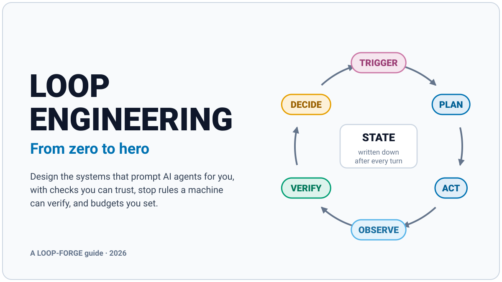

# Loop Engineering: From Zero to Hero
### Design the systems that prompt AI agents for you, with checks you can trust, stop rules a machine can verify, and budgets you set

> Written by LOOP-FORGE v1.0 (`docs/prompt.1.md`) at DEPTH `complete`, September 2026. Anything marked **⚠VERIFY** changes fast (features, flags, prices, limits, and this young field's history), so check it against current documentation before you rely on it.

---

## Start Here

**Who this is for.** You use Claude in a chat window or in Claude Code, and you've written plenty of prompts. You have never set up an automated loop. You don't need to code to follow this guide; the one script in the starter kit is explained line by line, and it runs in a safe practice mode by default.

**What loop engineering is, in one sentence.** Loop engineering is designing the system that prompts an AI agent for you: what starts each run, the goal it works toward, the tools and context it gets, how its work gets checked, what it writes down between runs, and when it stops or calls a human.

**Your hero outcome.** By the end, you'll be able to:
1. explain loop engineering in plain words, including how it grew out of prompt, context, and harness engineering;
2. turn a one-paragraph goal into a one-page Loop Spec with a done condition a machine can check, a checker separate from the maker, stop rules, a budget, written-down state, and a named human escalation;
3. run a first loop safely (the starter kit's dry run, or a built-in loop feature of your Claude app) and read its log;
4. score a loop on the Loop Scorecard (CALC-4), reach 75 or higher, and fix what's weak.

**The loop build checklist (preview).** These ten steps are the spine of the guide. The Quick Reference prints them again.

| # | Step | Taught in |
|---|---|---|
| 1 | Write the one-paragraph goal: what, why, how often | Level 1 |
| 2 | Rewrite it as an end state a machine can check (DONE WHEN) | Level 1 |
| 3 | Pick the trigger, the actor, and the autonomy rung | Level 1 |
| 4 | Choose the checker, make "not yet" its default, and estimate its trust with CALC-1 | Level 2 |
| 5 | Write the stop rules and the escalation; set the cap with CALC-2 | Level 3 |
| 6 | Decide where state lives and how the loop is isolated | Level 3 |
| 7 | Write `PROMPT.md` and do a dry run | Level 4 |
| 8 | Set the budget with CALC-3, using current prices | Level 4 |
| 9 | Run it small, log every iteration, and read the log | Level 5 |
| 10 | Score it with CALC-4, fix every criterion below 4, and version it | Level 5 |

Level 6 then automates the whole checklist with the Loop Generator.

**Two ways through.**
- **The full path (about 4–5 hours of reading and practice):** Levels 0 to 6 in order, then the Case Study Lab, then the practice gym (`BUILD-LOOP`, `GRADE-LOOP`, `UPGRADE-LOOP` in the prompt that built this guide).
- **The 60-minute fast track:** Level 0's Lesson → Level 1's Loop Spec → Level 2's maker/checker → Level 3's five stop families → a dry run of `kit/loop.sh` → a CALC-4 score for that loop.

**Icon legend.**

| Icon | Meaning | Icon | Meaning |
|---|---|---|---|
| ✅ | Best Practice: the default standard | 🧮 | Calculator: a formula-driven decision tool |
| 💡 | Tip: small, usable today | 🖼 | Figure |
| 🎯 | Trick: big payoff in specific situations | 🗣 | Council Debate |
| 🛠 | Hack: a shortcut, with its trade-off | 🏋 | Practice |
| ⛔ | Thing to Avoid: a named mistake | ✔ | Level-Up Check |
| 🧪 | Example: a short before → after | ⚠VERIFY | Changes fast; check current docs |
| 📚 | Case Study (in the Case Study Lab) | `BP-2.3` | An ID: Best Practice, Level 2, item 3 |
| ❓ | FAQ | | |

**The three layers.** This guide was built by running a loop, so it's easy to mix up three different things. Every example is labeled when confusion is possible.

| Layer | What it is | Examples |
|---|---|---|
| **Loop** | A system that prompts an AI agent, checks the result, writes down what happened, and decides whether to go again | A loop that fixes failing tests; a nightly report routine |
| **Prompt** | The words a loop hands its agent or its checker on each run | A `PROMPT.md` file; a `/goal` condition; a grader's rubric |
| **Guide** | What you're reading | This folder |

---

## Meet the Council

Nine seats wrote this guide. Each owns part of it and can object on one question. You'll hear them directly only in the short 🗣 Council Debate at the end of each level.

| Seat | Who | Owns | Their question |
|---|---|---|---|
| **ORBIT** (chair) | Principal loop engineer | The Map, the Loop Spec, final calls | "Does this move you a level closer to a loop you can trust?" |
| **WHISPERER** | Prompt engineer, Claude specialist | Loop prompts, goal wording, feedback messages | "Will Claude read this the same way on run 50 as on run 1?" |
| **ANVIL** | Meta-prompt engineer | Loops that write or improve prompts and loops; the Loop Generator | "When a loop changes its own prompt, what stops it drifting?" |
| **SMITH** | Practitioner who has run loops unattended | Examples, case studies, tips, tricks, hacks, the kit | "Would this survive a night unattended?" |
| **ABACUS** | Quant | The four calculators, the workbook, every number | "Is every number computed and shown?" |
| **PRISM** | Visual designer | The figures, captions, and alt text | "Does this figure teach one idea faster than the text?" |
| **SHERPA** | Teacher and beginner translator | Lessons, practice, FAQ, glossary | "Could a true beginner follow this alone?" |
| **RAZOR** | Skeptic with a veto | Things to Avoid, the red-team pass, the QA report | "What will break, mislead, or get ignored?" |
| **GOVERNOR** | Safety and cost critic with a veto | Caps, kill switches, the autonomy ladder, budgets | "If this runs all night with nobody watching, what's the worst it can do?" |

GOVERNOR is named for the spinning-ball governor that kept steam engines from running away: one of the first feedback devices ever built, and a good mascot for a guide about loops.

---

## The Map

| # | File | What's in it | Words (est.) |
|---|---|---|---|
| — | `README.md` | This page | 1,500 |
| 0 | [`00-level-0-zero.md`](00-level-0-zero.md) | What a loop is, and why prompting by hand runs out | 3,000 |
| 1 | [`01-level-1-starter.md`](01-level-1-starter.md) | Design a loop on one page | 3,000 |
| 2 | [`02-level-2-apprentice.md`](02-level-2-apprentice.md) | Check the work · CALC-1 Verifier Trust | 3,400 |
| 3 | [`03-level-3-engineer.md`](03-level-3-engineer.md) | Stop rules, state, and isolation · CALC-2 Tries-to-Success | 3,400 |
| 4 | [`04-level-4-author.md`](04-level-4-author.md) | Build and run real loops · CALC-3 Loop Budget | 3,600 |
| 5 | [`05-level-5-expert.md`](05-level-5-expert.md) | Observe, debug, and improve · CALC-4 Loop Scorecard | 3,400 |
| 6 | [`06-level-6-hero.md`](06-level-6-hero.md) | Loop systems, meta-loops, and the Loop Generator | 3,200 |
| 7 | [`07-case-study-lab.md`](07-case-study-lab.md) | Four end-to-end builds: code, KJV Bible study, options risk brief, and this guide itself | 4,500 |
| 8 | [`08-faq.md`](08-faq.md) | 30 questions learners actually ask | 2,800 |
| 9 | [`09-calculator-toolkit.md`](09-calculator-toolkit.md) | All four blank worksheets and spreadsheet formulas | 1,200 |
| 10 | [`10-quick-reference.md`](10-quick-reference.md) | The one-page poster and every checklist | 1,000 |
| 11 | [`11-glossary.md`](11-glossary.md) | Every term, defined | 1,500 |
| 12 | [`12-sources.md`](12-sources.md) | Where the facts come from | 500 |
| 13 | [`13-council-qa-report.md`](13-council-qa-report.md) | What was checked, what's still ⚠VERIFY, known limits | 1,200 |

**Tools that come with the guide.**
- [`workbook/loop-engineering-workbook.xlsx`](workbook/loop-engineering-workbook.xlsx): all four calculators, a Loop Canvas, and a Run Log, with live formulas. There's one CSV per sheet in [`workbook/csv/`](workbook/csv/) if your spreadsheet app prefers those.
- [`kit/`](kit/): a Loop Spec template, a loop prompt template, a progress file, a safe loop script, and the Loop Generator prompt. Start with [`kit/README.md`](kit/README.md).
- [`MANIFEST.md`](MANIFEST.md) lists every file and where it's used.

**Start now:** [Level 0 · ZERO →](00-level-0-zero.md)
